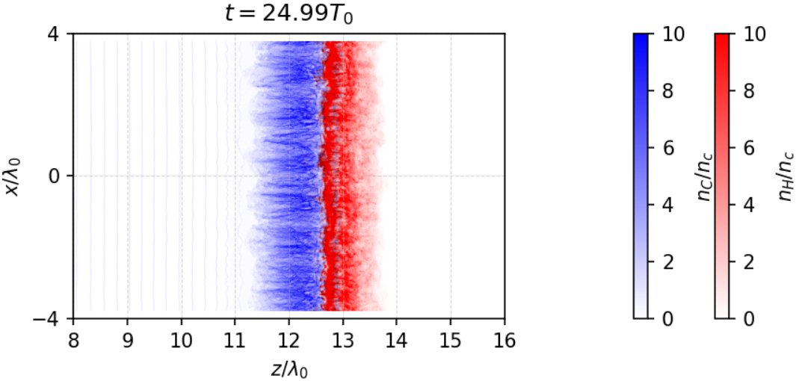
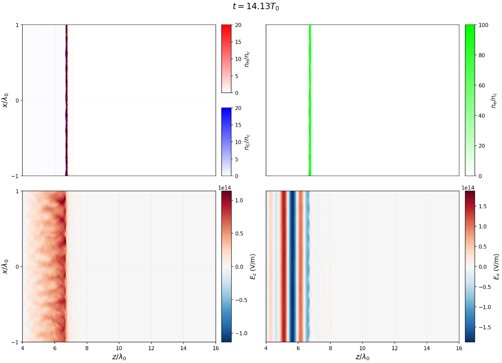
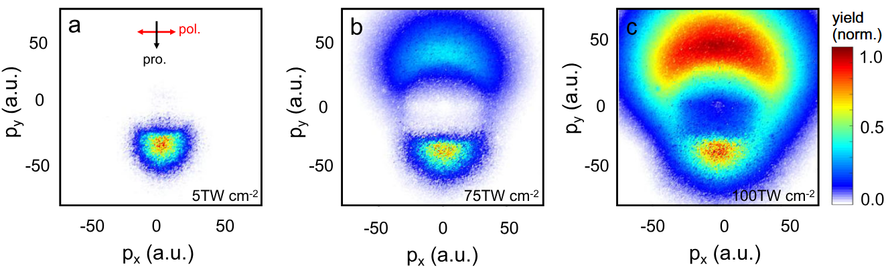

说明：在Jupyter上分析WarpX跑完之后的诊断文件。针对不同的模拟有一些可以固定的notebook，遂记录备用。


## 1.物种数密度


### 1.1 单步

### 1.1.1 单步单物种

```python
# =========== 单步绘制质子数密度 ===========
import numpy as np
import matplotlib.pyplot as plt
from openpmd_viewer import OpenPMDTimeSeries
from scipy import constants as C
import os


# ==================== 参数配置 ====================
data_path = '../diags/field'

SPECIES = 'H'
FIELD = f'rho_{SPECIES}'

# 指定 iteration
ITERATION = 20000


# ==================== 物理常数 ====================
lambda1 = 1e-6
omega = 2 * np.pi * C.c / lambda1
T0 = 1 / omega

nc = 1.1e27
CHARGE = C.e


# ==================== 单位 ====================
DX = lambda1 / (2*np.pi)
DY = lambda1 / (2*np.pi)

Z_UNIT = '$c/\omega_0$'
X_UNIT = '$c/\omega_0$'


# ==================== 绘图参数 ====================
CMAP = 'BuPu'

FIG_SIZE = (6,5)
DPI = 400

VMIN = 0
VMAX = 100


# ==================== 范围 ====================
ENABLE_RANGE = True

Z_RANGE = (0,25)
X_RANGE = (-25,25)


# ==================== 读取 ====================
ts = OpenPMDTimeSeries(data_path)

rho, info = ts.get_field(
    field=FIELD,
    iteration=ITERATION
)


# ==================== 密度转换 ====================
# rho [C/m3]
# n/nc
n_i = rho / CHARGE / nc


# ==================== 坐标 ====================
z_coords = info.z / DX
x_coords = info.x / DY


# ==================== 裁剪 ====================
if ENABLE_RANGE:

    z_mask = (z_coords >= Z_RANGE[0]) & (z_coords <= Z_RANGE[1])
    x_mask = (x_coords >= X_RANGE[0]) & (x_coords <= X_RANGE[1])

    n_plot = n_i[z_mask, :][:, x_mask].T

    extent = [
        z_coords[z_mask][0],
        z_coords[z_mask][-1],
        x_coords[x_mask][0],
        x_coords[x_mask][-1]
    ]

else:

    n_plot = n_i.T

    extent = [
        z_coords[0],
        z_coords[-1],
        x_coords[0],
        x_coords[-1]
    ]


# ==================== 时间 ====================
time_idx = list(ts.iterations).index(ITERATION)

time_norm = ts.t[time_idx] / T0


# ==================== 绘图 ====================
fig, ax = plt.subplots(figsize=FIG_SIZE)

im = ax.imshow(
    n_plot,
    cmap=CMAP,
    extent=extent,
    origin='lower',
    aspect='auto',
    vmin=VMIN,
    vmax=VMAX
)


ax.set_xlabel(f'z ({Z_UNIT})')
ax.set_ylabel(f'x ({X_UNIT})')

ax.set_title(
    f'Proton Density\n'
    f'$t={time_norm:.2f}\\ \\omega_0^{{-1}}$'
)


cbar = plt.colorbar(
    im,
    ax=ax,
    fraction=0.042,
    pad=0.02
)

cbar.set_label('$n_H/n_c$')


plt.tight_layout()
plt.show()


# 如果需要保存：
# plt.savefig(
#     f'nH_{ITERATION:06d}.png',
#     dpi=DPI,
#     bbox_inches='tight'
# )
```

### 1.1.2 单步多物种

分层两物种绘图的一种暂行方案

```python
import numpy as np
import matplotlib.pyplot as plt
from openpmd_viewer import OpenPMDTimeSeries
from scipy import constants as C
from matplotlib.colors import Normalize, LinearSegmentedColormap
from matplotlib.cm import ScalarMappable

# ================= 参数 =================
data_path = '../diag_p02/full'
t_target = 25     # T0
save_path = '../fig/p02_HC_white_RGB_25T.png'

# ================= 激光参数 =================
lambda1 = 1.06e-6
c = C.c
T0 = lambda1/c
nc = 1.115e27/(lambda1*1e6)**2
qe = C.e

# ================= 空间范围 =================
Z_RANGE = (8,16)
X_RANGE = (-4,4)

# ================= 色标范围 =================
VMIN_H = 0
VMAX_H = 10
VMIN_C = 0
VMAX_C = 10

# ================= 读取 =================
ts = OpenPMDTimeSeries(data_path)
time_array = np.array(ts.t)
time_T0 = time_array/T0
idx = np.argmin(np.abs(time_T0-t_target))
iteration = ts.iterations[idx]
t_real = time_T0[idx]
print(f"target={t_target:.2f}T0, selected={t_real:.2f}T0, iteration={iteration}")

# ================= 获取密度 =================
rho_H, info = ts.get_field(field='rho_H', iteration=iteration)
rho_C, _ = ts.get_field(field='rho_C', iteration=iteration)

# ================= 转换为粒子数密度 =================
nH = rho_H/(qe*nc)          # H: Z=1
nC = rho_C/(6*qe*nc)        # C: Z=6

# ================= 坐标 =================
z = info.z/lambda1
x = info.x/lambda1

# ================= crop =================
z_mask = ((z>=Z_RANGE[0]) & (z<=Z_RANGE[1]))
x_mask = ((x>=X_RANGE[0]) & (x<=X_RANGE[1]))
H = nH[z_mask,:][:,x_mask].T
Cden = nC[z_mask,:][:,x_mask].T
extent = [z[z_mask][0], z[z_mask][-1], x[x_mask][0], x[x_mask][-1]]

# =====================================================
#              RGB white-background mixing
# =====================================================
norm_H = Normalize(vmin=VMIN_H, vmax=VMAX_H)
norm_C = Normalize(vmin=VMIN_C, vmax=VMAX_C)
H_norm = norm_H(H)
C_norm = norm_C(Cden)

# ---------------- H layer ----------------
RGB_H = np.zeros(H.shape+(3,))
RGB_H[...,0] = 1
RGB_H[...,1] = 1-H_norm
RGB_H[...,2] = 1-H_norm

# ---------------- C layer ----------------
RGB_C = np.zeros(Cden.shape+(3,))
RGB_C[...,0] = 1-C_norm
RGB_C[...,1] = 1-C_norm
RGB_C[...,2] = 1

# ---------------- combine ----------------
RGB = RGB_H * RGB_C
RGB = np.clip(RGB, 0, 1)

# =====================================================
#                  colorbar
# =====================================================
cmap_H_bar = LinearSegmentedColormap.from_list("H_bar", ["white", "red"])
cmap_C_bar = LinearSegmentedColormap.from_list("C_bar", ["white", "blue"])

# =====================================================
#                  plot
# =====================================================
fig, ax = plt.subplots(figsize=(6,3), dpi=150)
ax.imshow(RGB, extent=extent, origin='lower', aspect='auto')
ax.set_xlabel(r"$z/\lambda_0$")
ax.set_ylabel(r"$x/\lambda_0$")
ax.set_xticks(np.arange(Z_RANGE[0], Z_RANGE[1]+1, 1))
ax.set_yticks(np.arange(X_RANGE[0], X_RANGE[1]+1, 4))
ax.grid(True, linestyle="--", linewidth=0.5, alpha=0.5)
ax.set_title(rf"$t={t_real:.2f}T_0$")

# =====================================================
#                 H colorbar
# =====================================================
sm_H = ScalarMappable(norm=norm_H, cmap=cmap_H_bar)
sm_H.set_array([])
cbar_H = fig.colorbar(sm_H, ax=ax, fraction=0.046, pad=0.08)
cbar_H.set_label(r"$n_H/n_c$")

# =====================================================
#                 C colorbar
# =====================================================
sm_C = ScalarMappable(norm=norm_C, cmap=cmap_C_bar)
sm_C.set_array([])
cbar_C = fig.colorbar(sm_C, ax=ax, fraction=0.046, pad=0.22)
cbar_C.set_label(r"$n_C/n_c$")

# ================= 保存 =================
plt.tight_layout()
print(f"Saving figure: {save_path}")
plt.savefig(save_path, dpi=300, bbox_inches='tight')
plt.show()
print("Done!")
```



适合重叠不严重的时候；重叠会产生其它颜色


### 1.2 多步静态叠加

适合于薄靶RPA，选取合适的cmap(最低值对应白色)，可以比较紧凑地展示靶的形状变化。不同时间步之间避免重合，因为是数密度值的直接相加。

```python
# =========== 多步叠加数密度图(直接相加) v1.1.13===========
import numpy as np
import matplotlib.pyplot as plt
from openpmd_viewer import OpenPMDTimeSeries
import os
import warnings
from scipy import constants as C

# ==================== 参数配置 ====================
data_path = '../diagCP/field'
fig_dir = '../fig'
SPECIES = 'hydrogen'           # 物种
FIELD = f'rho_{SPECIES}'       # 场量

# 文件名设置
FILENAME = 'ni_multistep_CP.png'  # 保存文件名

# 物理常数
lambda0 = 1e-6
CHARGE = C.e
T0 = lambda0/C.c
nc = 1.1e27                    # 临界密度

# 单位换算因子（原始数据 -> 绘图单位）
DX = 7e-6         # 横轴（z方向）: m -> um
DY = 8e-6         # 纵轴（x方向）: m -> um
DT = T0           # 时间: s -> T0
DN = CHARGE * nc  # 电荷密度 -> nc单位（除以DN得到归一化密度）

# 单位标签
Z_UNIT = '$R_c$'
X_UNIT = '$R_0$'
T_UNIT = '$T_0$'
N_UNIT = '$n_c$'

# 绘图参数
FIG_SIZE = (10, 6)              # 图形大小
DPI = 150                       # 保存分辨率
CMAP = 'gnuplot2_r'                # 颜色映射

# 字体大小配置
AXIS_LABEL_FONTSIZE = 20        # 坐标轴标签字号
AXIS_TICK_FONTSIZE = 18         # 坐标轴数字（刻度）字号
CBAR_LABEL_FONTSIZE = 20        # colorbar标签字号
CBAR_TICK_FONTSIZE = 18         # colorbar数字（刻度）字号

# ==================== 叠加配置 ====================
# 选择的时间步（帧索引或时间值）
TIME_STEPS = [0,11,22,33,44,57,68]  # 要叠加的时间步

# 空间范围
Z_RANGE = None              # None/(z1,z2)
X_RANGE = None              # None/(x1,x2)

# 密度范围（所有时间步共用相同的颜色映射）
N_RANGE = (0, 150)             # 密度范围, None表示自动

# ==================== 加载数据 ====================
print("正在加载诊断数据...")
ts = OpenPMDTimeSeries(data_path)

# 创建保存目录
os.makedirs(fig_dir, exist_ok=True)

# 获取所有迭代和时间
all_iterations = ts.iterations
all_times = ts.t
all_times_T0 = all_times / DT
print(f"总可用步数: {len(all_iterations)}")

# ==================== 处理时间步 ====================
def get_iteration_from_time(ts, time_value):
    """根据时间值获取对应的迭代索引"""
    time_sec = time_value * DT
    idx = np.argmin(np.abs(ts.t - time_sec))
    return idx, ts.iterations[idx]

selected_frames = []
selected_times_val = []

for step in TIME_STEPS:
    if isinstance(step, int) and step < len(all_iterations):
        selected_frames.append(step)
        selected_times_val.append(all_times_T0[step])
        print(f"选择帧 {step}, 时间 t={all_times_T0[step]:.2f} {T_UNIT}")
    elif isinstance(step, (float, int)):
        idx, iteration = get_iteration_from_time(ts, step)
        selected_frames.append(idx)
        selected_times_val.append(step)
        print(f"选择时间 t={step} {T_UNIT}, 对应帧 {idx}")
    else:
        raise ValueError(f"无法识别的时间步格式: {step}")

n_steps = len(selected_frames)
print(f"\n共选择 {n_steps} 个时间步进行叠加")

# ==================== 获取坐标信息 ====================
_, info_first = ts.get_field(field=FIELD, iteration=all_iterations[selected_frames[0]])
z_coords_full = info_first.z / DX
x_coords_full = info_first.x / DY

# 应用空间范围
def get_indices_and_extent(coords, range_val, unit_label):
    if range_val is None:
        return slice(None), (coords[0], coords[-1])
    else:
        mask = (coords >= range_val[0]) & (coords <= range_val[1])
        indices = np.where(mask)[0]
        if len(indices) == 0:
            warnings.warn(f"范围 {range_val} {unit_label} 内无数据")
            return slice(None), (coords[0], coords[-1])
        return indices, [range_val[0], range_val[1]]

z_indices, z_extent = get_indices_and_extent(z_coords_full, Z_RANGE, Z_UNIT)
x_indices, x_extent = get_indices_and_extent(x_coords_full, X_RANGE, X_UNIT)
extent = [z_extent[0], z_extent[1], x_extent[0], x_extent[1]]

# ==================== 读取并叠加数据 ====================
print("\n正在读取并叠加数据...")
sum_density = None

for idx, frame in enumerate(selected_frames):
    iteration = all_iterations[frame]
    rho, _ = ts.get_field(field=FIELD, iteration=iteration)
    n_norm = rho / DN
    
    # 应用空间裁剪
    n_cropped = n_norm[z_indices, :][:, x_indices]
    
    # 直接相加
    if sum_density is None:
        sum_density = n_cropped.copy()
    else:
        sum_density += n_cropped
    
    print(f"  已叠加: t={selected_times_val[idx]:.2f}{T_UNIT}")

# ==================== 计算密度范围 ====================
if N_RANGE is None:
    VMIN, VMAX = 0, np.max(sum_density)
    print(f"\n自动密度范围: 0 - {VMAX:.2f} {N_UNIT}")
else:
    VMIN, VMAX = N_RANGE
    print(f"\n指定密度范围: {VMIN} - {VMAX} {N_UNIT}")

# ==================== 绘制叠加结果 ====================
fig, ax = plt.subplots(figsize=FIG_SIZE)

# 转置用于显示
sum_display = sum_density.T

# 绘制叠加结果
im = ax.imshow(sum_display, cmap=CMAP, extent=extent,
               origin='lower', aspect='auto',
               vmin=VMIN, vmax=VMAX)

# 设置坐标轴标签和刻度字号
ax.set_xlabel(f'z ({Z_UNIT})', fontsize=AXIS_LABEL_FONTSIZE)
ax.set_ylabel(f'x ({X_UNIT})', fontsize=AXIS_LABEL_FONTSIZE)

# 设置坐标轴刻度数字字号
ax.tick_params(axis='both', which='major', labelsize=AXIS_TICK_FONTSIZE)

# 添加颜色条（分别设置标签和刻度字号）
cbar = fig.colorbar(im, ax=ax, fraction=0.046, pad=0.04)
cbar.set_label(f'$n_i$ ({N_UNIT})', fontsize=CBAR_LABEL_FONTSIZE)
cbar.ax.tick_params(labelsize=CBAR_TICK_FONTSIZE)

# 添加网格
ax.grid(True, alpha=0.2, linestyle=':', linewidth=0.5)

# ==================== 保存图片 ====================
save_path = os.path.join(fig_dir, FILENAME)
plt.savefig(save_path, dpi=DPI, bbox_inches='tight')
print(f"\n图片已保存: {save_path}")

# ==================== 显示信息 ====================
print("\n=== 叠加信息 ===")
print(f"叠加时间步数: {n_steps}")
print(f"时间步列表: {[f'{t:.2f}' for t in selected_times_val]} {T_UNIT}")
print(f"时间范围: {selected_times_val[0]:.2f} - {selected_times_val[-1]:.2f} {T_UNIT}")
print(f"密度范围: {VMIN:.2f} - {VMAX:.2f} {N_UNIT}")
print(f"最大叠加值: {np.max(sum_density):.2f} {N_UNIT}")

plt.show()
```


多步叠加双模拟对比版(不过是共享坐标轴与colorbar)

```python
# =========== 多步叠加数密度(直接相加) 双模拟对比v1.1.13 ===========
import numpy as np
import matplotlib.pyplot as plt
from openpmd_viewer import OpenPMDTimeSeries
import os
import warnings
from scipy import constants as C

# ==================== 参数配置 ====================
# 模拟1路径
data_path1 = '../diagc1/field'      # 修改为你的第一个模拟路径
# 模拟2路径
data_path2 = '../diagp1/field'     # 修改为你的第二个模拟路径

fig_dir = '../fig'
SPECIES = 'hydrogen'           # 物种
FIELD = f'rho_{SPECIES}'       # 场量

# 文件名设置
FILENAME = 'ni_multistep_compare.png'  # 保存文件名

# 物理常数
lambda0 = 1e-6
CHARGE = C.e
T0 = lambda0/C.c
nc = 1.1e27                    # 临界密度

# 单位换算因子（原始数据 -> 绘图单位）
DX = 1e-6         # 横轴（z方向）: m -> um
DY = 1e-6         # 纵轴（x方向）: m -> um
DT = T0           # 时间: s -> T0
DN = CHARGE * nc  # 电荷密度 -> nc单位（除以DN得到归一化密度）

# 单位标签
Z_UNIT = '$\mu m$'
X_UNIT = '$\mu m$'
T_UNIT = '$T_0$'
N_UNIT = '$n_c$'

# 绘图参数
FIG_SIZE = (12, 5)              # 图形大小
DPI = 150                       # 保存分辨率
FONT_SIZE = 12                  # 字体大小
SUBPLOT_ADJUST = {'wspace': 0.05}  # 子图间距

# ==================== 叠加配置 ====================
# 选择的时间步（帧索引或时间值）
TIME_STEPS = [12, 24, 36, 48, 60, 72, 84]  # 要叠加的时间步

# 空间范围
Z_RANGE = (-1,9)              # z方向范围，None表示全部
X_RANGE = None              # x方向范围，None表示全部

# 颜色映射
CMAP = 'hot_r'                 # 颜色映射

# 密度范围（两个模拟共用相同的颜色映射）
N_RANGE = (0, 600)             # 密度范围, None表示自动

# ==================== 定义加载和处理函数 ====================
def load_and_sum(data_path, time_steps, z_indices, x_indices):
    """加载并叠加指定时间步的密度数据"""
    print(f"\n正在处理: {data_path}")
    ts = OpenPMDTimeSeries(data_path)
    
    all_iterations = ts.iterations
    all_times = ts.t
    all_times_T0 = all_times / DT
    
    def get_iteration_from_time(ts, time_value):
        """根据时间值获取对应的迭代索引"""
        time_sec = time_value * DT
        idx = np.argmin(np.abs(ts.t - time_sec))
        return idx, ts.iterations[idx]
    
    selected_frames = []
    selected_times_val = []
    
    for step in time_steps:
        if isinstance(step, int) and step < len(all_iterations):
            selected_frames.append(step)
            selected_times_val.append(all_times_T0[step])
            print(f"选择帧 {step}, 时间 t={all_times_T0[step]:.2f} {T_UNIT}")
        elif isinstance(step, (float, int)):
            idx, iteration = get_iteration_from_time(ts, step)
            selected_frames.append(idx)
            selected_times_val.append(step)
            print(f"选择时间 t={step} {T_UNIT}, 对应帧 {idx}")
        else:
            raise ValueError(f"无法识别的时间步格式: {step}")
    
    # 读取并叠加数据
    sum_density = None
    for idx, frame in enumerate(selected_frames):
        iteration = all_iterations[frame]
        rho, _ = ts.get_field(field=FIELD, iteration=iteration)
        n_norm = rho / DN
        
        # 应用空间裁剪
        n_cropped = n_norm[z_indices, :][:, x_indices]
        
        if sum_density is None:
            sum_density = n_cropped.copy()
        else:
            sum_density += n_cropped
        
        print(f"  已叠加: t={selected_times_val[idx]:.2f}{T_UNIT}")
    
    return sum_density, selected_times_val

# ==================== 获取坐标信息（使用第一个模拟） ====================
print("正在加载诊断数据...")
ts1 = OpenPMDTimeSeries(data_path1)
all_iterations1 = ts1.iterations

_, info_first = ts1.get_field(field=FIELD, iteration=all_iterations1[0])
z_coords_full = info_first.z / DX
x_coords_full = info_first.x / DY

# 应用空间范围
def get_indices_and_extent(coords, range_val, unit_label):
    if range_val is None:
        return slice(None), (coords[0], coords[-1])
    else:
        mask = (coords >= range_val[0]) & (coords <= range_val[1])
        indices = np.where(mask)[0]
        if len(indices) == 0:
            warnings.warn(f"范围 {range_val} {unit_label} 内无数据")
            return slice(None), (coords[0], coords[-1])
        return indices, [range_val[0], range_val[1]]

z_indices, z_extent = get_indices_and_extent(z_coords_full, Z_RANGE, Z_UNIT)
x_indices, x_extent = get_indices_and_extent(x_coords_full, X_RANGE, X_UNIT)
extent = [z_extent[0], z_extent[1], x_extent[0], x_extent[1]]

# ==================== 加载两个模拟的数据 ====================
# 创建保存目录
os.makedirs(fig_dir, exist_ok=True)

# 处理模拟1
sum_density1, times1 = load_and_sum(data_path1, TIME_STEPS, z_indices, x_indices)

# 处理模拟2
sum_density2, times2 = load_and_sum(data_path2, TIME_STEPS, z_indices, x_indices)

# ==================== 计算密度范围 ====================
if N_RANGE is None:
    vmin = 0
    vmax = max(np.max(sum_density1), np.max(sum_density2))
    print(f"\n自动密度范围: {vmin:.2f} - {vmax:.2f} {N_UNIT}")
else:
    vmin, vmax = N_RANGE
    print(f"\n指定密度范围: {vmin} - {vmax} {N_UNIT}")

# ==================== 绘制对比图 ====================
fig, (ax1, ax2) = plt.subplots(1, 2, figsize=FIG_SIZE)
plt.subplots_adjust(**SUBPLOT_ADJUST)  # 设置子图间距

# 转置用于显示
sum_display1 = sum_density1.T
sum_display2 = sum_density2.T

# 绘制模拟1

im1 = ax1.imshow(sum_display1, cmap=CMAP, extent=extent,
                 origin='lower', aspect='auto',
                 vmin=vmin, vmax=vmax)
ax1.axhline(y=0, color='black', linestyle='--', linewidth=1.5, alpha=0.8)
ax1.set_xlabel(f'z ({Z_UNIT})', fontsize=FONT_SIZE )
ax1.set_ylabel(f'x ({X_UNIT})', fontsize=FONT_SIZE )
ax1.grid(True, alpha=0.2, linestyle=':', linewidth=0.5)
ax1.tick_params(axis='y', labelsize=12)
ax1.tick_params(axis='x', labelsize=12)

# 绘制模拟2 - 保留z坐标，只隐藏y轴（x方向）的刻度数字和标签
im2 = ax2.imshow(sum_display2, cmap=CMAP, extent=extent,
                 origin='lower', aspect='auto',
                 vmin=vmin, vmax=vmax)
ax2.axhline(y=0, color='black', linestyle='--', linewidth=1.5, alpha=0.8)
ax2.set_xlabel(f'z ({Z_UNIT})', fontsize=FONT_SIZE )  # 保留z坐标标签
ax2.set_ylabel('')  # 清空y轴标签（x方向）

# 只隐藏y轴（左侧）的刻度数字，保留x轴的刻度数字
ax2.tick_params(axis='y', labelleft=False, labelsize=12)  # 隐藏y轴刻度数字
ax2.tick_params(axis='x', labelbottom=True, labelsize=12)  # x轴刻度数字保留（默认就是True）

ax2.grid(True, alpha=0.2, linestyle=':', linewidth=0.5)

# 添加右侧colorbar（两个子图共用）
cbar = fig.colorbar(im2, ax=[ax1, ax2], label=f'$n_i$ ({N_UNIT})',
                    fraction=0.046, pad=0.02)
cbar.ax.tick_params(labelsize=FONT_SIZE )
cbar.set_label(f'$n_i$ ({N_UNIT})', fontsize=12) 

# ==================== 保存图片 ====================
save_path = os.path.join(fig_dir, FILENAME)
plt.savefig(save_path, dpi=DPI, bbox_inches='tight')
print(f"\n图片已保存: {save_path}")

# ==================== 显示信息 ====================
print("\n=== 叠加信息 ===")
print(f"叠加时间步数: {len(TIME_STEPS)}")
print(f"时间步列表: {[f'{t:.2f}' for t in times1]} {T_UNIT}")
print(f"时间范围: {times1[0]:.2f} - {times1[-1]:.2f} {T_UNIT}")
print(f"密度范围: {vmin:.2f} - {vmax:.2f} {N_UNIT}")
print(f"模拟1最大叠加值: {np.max(sum_density1):.2f} {N_UNIT}")
print(f"模拟2最大叠加值: {np.max(sum_density2):.2f} {N_UNIT}")

plt.show()
```

### 1.3 动态Movie

```python
# =========== 密度演化GIF ===========
import numpy as np
import matplotlib.pyplot as plt
from matplotlib.animation import FuncAnimation
from openpmd_viewer import OpenPMDTimeSeries
import os
import warnings
from IPython.display import HTML, display
from scipy import constants as C

# ==================== 参数配置 ====================
data_path = '../diags/full'
fig_dir = '../fig'
SPECIES = 'ele'           # 物种
FIELD = f'rho_{SPECIES}'       # 场量

# 文件名设置
FILENAME = None  # None: 自动生成 f'{SPECIES}_density.gif', 或自定义如 'my_density.gif'

# 物理常数
lambda0 = 1e-6
CHARGE = -C.e
T0 = lambda0/C.c
nc = 1.1e27                    # 临界密度

# 单位换算因子（原始数据 -> 绘图单位）
DX = 1e-6         # 横轴（z方向）: m -> um
DY = 1e-6         # 纵轴（x方向）: m -> um
DT = T0           # 时间: s -> T0
DN = CHARGE * nc  # 电荷密度 -> nc单位（除以DN得到归一化密度）

# 单位标签
Z_UNIT = '$\mu m$'
X_UNIT = '$\mu m$'
T_UNIT = '$T_0$'
N_UNIT = '$n_c$'

# 绘图参数
CMAP = 'hot_r'                  # 颜色映射
FIG_SIZE = (8, 5)              # 图形大小
GIF_FPS = 5                    # GIF帧率
GIF_INTERVAL_MS = 1000/GIF_FPS # 动画间隔(ms)
GIF_DPI = 100                  # GIF分辨率

# ==================== 范围选择 ====================
# 范围限制: None 表示全部，否则为 (min, max)
Z_RANGE = None              # z方向范围（横轴）单位: Z_UNIT
X_RANGE = None            # x方向范围（纵轴）单位: X_UNIT
T_RANGE = None                 # 时间范围（帧索引或时间值）单位: T_UNIT (None=全部, 或 (t_min, t_max))
N_RANGE = (0, 100)             # 密度范围（只改变颜色映射，不改变数据）单位: N_UNIT (None=自动)

# ==================== 加载数据 ====================
print("正在加载诊断数据...")
ts = OpenPMDTimeSeries(data_path)

# 创建保存目录
os.makedirs(fig_dir, exist_ok=True)

# 设置文件名
if FILENAME is None:
    gif_filename = os.path.join(fig_dir, f'{SPECIES}_density.gif')
else:
    # 确保文件名有 .gif 后缀
    if not FILENAME.endswith('.gif'):
        FILENAME += '.gif'
    gif_filename = os.path.join(fig_dir, FILENAME)

# 获取所有迭代和时间
all_iterations = ts.iterations
all_times = ts.t  # 单位: 秒

# 转换时间为T_UNIT
all_times_T0 = all_times / DT

# ==================== 应用时间范围 ====================
def apply_time_range(iterations, times, t_range):
    """应用时间范围过滤
    
    t_range 支持以下格式:
    - None: 全部时间
    - (start, end): 范围（可以是帧索引或时间值）
    - start: 从 start 到结束
    """
    if t_range is None:
        return list(range(len(iterations))), iterations, times
    
    # 处理单个值的情况
    if not isinstance(t_range, (tuple, list)):
        t_min, t_max = t_range, None
    elif len(t_range) == 1:
        t_min, t_max = t_range[0], None
    else:
        t_min, t_max = t_range[0], t_range[1]
    
    # 判断是帧索引还是时间值
    if isinstance(t_min, int) and t_min < len(iterations):
        # 帧索引范围
        if t_max is None:
            indices = list(range(t_min, len(iterations)))
            print(f"时间范围（帧索引）: {t_min} - {len(iterations)-1}")
        else:
            if isinstance(t_max, int):
                indices = list(range(t_min, min(t_max + 1, len(iterations))))
                print(f"时间范围（帧索引）: {t_min} - {t_max}")
            else:
                # 混合模式: 起始帧索引，结束时间值
                times_in_unit = times / DT if DT != 1 else times
                mask = (times_in_unit >= t_min) & (times_in_unit <= t_max)
                indices = np.where(mask)[0].tolist()
                print(f"时间范围（帧索引起始，{T_UNIT}结束）: 帧≥{t_min} 且 t≤{t_max}")
    else:
        # 时间值范围
        times_in_unit = times / DT if DT != 1 else times
        if t_max is None:
            mask = times_in_unit >= t_min
            print(f"时间范围（{T_UNIT}）: ≥{t_min}")
        else:
            mask = (times_in_unit >= t_min) & (times_in_unit <= t_max)
            print(f"时间范围（{T_UNIT}）: {t_min} - {t_max}")
        indices = np.where(mask)[0].tolist()
    
    if len(indices) == 0:
        warnings.warn(f"时间范围 {t_range} {T_UNIT} 内无数据，使用全部数据")
        return list(range(len(iterations))), iterations, times
    
    filtered_iterations = [iterations[i] for i in indices]
    filtered_times = times[indices]
    
    print(f"选择 {len(indices)}/{len(iterations)} 个时间步")
    return indices, filtered_iterations, filtered_times

frame_indices, selected_iterations, selected_times = apply_time_range(
    all_iterations, all_times, T_RANGE
)

# 获取坐标信息用于范围裁剪
_, info_first = ts.get_field(field=FIELD, iteration=selected_iterations[0])
z_coords_full = info_first.z / DX  # 转换为 Z_UNIT
x_coords_full = info_first.x / DY  # 转换为 X_UNIT

# ==================== 应用空间范围 ====================
def get_indices_and_extent(coords, range_val, unit_label):
    """获取索引切片和extent范围"""
    if range_val is None:
        return slice(None), (coords[0], coords[-1])
    else:
        mask = (coords >= range_val[0]) & (coords <= range_val[1])
        indices = np.where(mask)[0]
        if len(indices) == 0:
            warnings.warn(f"范围 {range_val} {unit_label} 内无数据")
            return slice(None), (coords[0], coords[-1])
        return indices, [range_val[0], range_val[1]]

z_indices, z_extent = get_indices_and_extent(z_coords_full, Z_RANGE, Z_UNIT)
x_indices, x_extent = get_indices_and_extent(x_coords_full, X_RANGE, X_UNIT)
extent = [z_extent[0], z_extent[1], x_extent[0], x_extent[1]]

# 打印范围信息
print("\n=== 范围设置 ===")
if Z_RANGE is None:
    print(f"z范围: [{z_coords_full[0]:.1f}, {z_coords_full[-1]:.1f}] {Z_UNIT}")
else:
    print(f"z范围: {Z_RANGE} {Z_UNIT}")
    
if X_RANGE is None:
    print(f"x范围: [{x_coords_full[0]:.1f}, {x_coords_full[-1]:.1f}] {X_UNIT}")
else:
    print(f"x范围: {X_RANGE} {X_UNIT}")
    
if T_RANGE is None:
    print(f"t范围: [{all_times_T0[0]:.2f}, {all_times_T0[-1]:.2f}] {T_UNIT} ({len(selected_iterations)} 帧)")
else:
    print(f"t范围: {selected_times[0]/DT:.2f} - {selected_times[-1]/DT:.2f} {T_UNIT} ({len(selected_iterations)} 帧)")

# ==================== 计算密度范围 ====================
print("\n正在计算密度范围...")
if N_RANGE is None:
    n_max = 0
    for iteration in selected_iterations:
        rho, _ = ts.get_field(field=FIELD, iteration=iteration)
        n_norm = rho / DN  # 直接得到归一化密度 (n/nc)
        
        # 应用范围裁剪
        if isinstance(z_indices, np.ndarray):
            n_cropped = n_norm[z_indices, :][:, x_indices]
        else:
            n_cropped = n_norm[:, x_indices] if isinstance(x_indices, np.ndarray) else n_norm
        
        n_max = max(n_max, np.max(n_cropped))
    
    VMIN, VMAX = 0, n_max
    print(f"自动密度范围: 0 - {n_max:.2f} {N_UNIT}")
else:
    VMIN, VMAX = N_RANGE
    print(f"指定密度范围: {VMIN} - {VMAX} {N_UNIT}")

# ==================== 初始化图形 ====================
iteration = selected_iterations[0]
rho_first, _ = ts.get_field(field=FIELD, iteration=iteration)
n_norm_first = rho_first / DN  # 直接得到归一化密度

# 应用范围裁剪并转置 (imshow需要)
def get_display_data(n_norm, z_indices, x_indices):
    """获取用于显示的数据（已裁剪和转置）"""
    if isinstance(z_indices, np.ndarray):
        data = n_norm[z_indices, :][:, x_indices]
    else:
        data = n_norm[:, x_indices] if isinstance(x_indices, np.ndarray) else n_norm
    return data.T

n_display = get_display_data(n_norm_first, z_indices, x_indices)

fig, ax = plt.subplots(figsize=FIG_SIZE)

im = ax.imshow(n_display, cmap=CMAP, extent=extent,
               origin='lower', aspect='auto',
               vmin=VMIN, vmax=VMAX)

# 设置标签和标题
ax.set_xlabel(f'z ({Z_UNIT})', fontsize=12)
ax.set_ylabel(f'x ({X_UNIT})', fontsize=12)

# 时间标题 - 修正 LaTeX 语法
t_current = selected_times[0] / DT
if N_UNIT == '$n_c$':
    title_text = f'{SPECIES.capitalize()} Density ($n_i/n_c$) at t={t_current:.2f} {T_UNIT}'
else:
    title_text = f'{SPECIES.capitalize()} Density ($n_i$ in {N_UNIT}) at t={t_current:.2f} {T_UNIT}'
time_text = ax.set_title(title_text, fontsize=14)

# 添加颜色条
cbar = plt.colorbar(im, ax=ax, label=f'$n_i$ ({N_UNIT})', fraction=0.04, pad=0.01)
plt.tight_layout()

# ==================== 动画更新函数 ====================
def update(frame_idx):
    """更新动画帧"""
    iteration = selected_iterations[frame_idx]
    rho, _ = ts.get_field(field=FIELD, iteration=iteration)
    n_norm = rho / DN  # 直接得到归一化密度
    
    # 应用范围裁剪并转置
    n_display = get_display_data(n_norm, z_indices, x_indices)
    im.set_data(n_display)
    
    # 更新时间标题 - 修正 LaTeX 语法
    t_current = selected_times[frame_idx] / DT
    if N_UNIT == '$n_c$':
        title_text = f'{SPECIES.capitalize()} Density ($n_i/n_c$) at t={t_current:.2f} {T_UNIT}'
    else:
        title_text = f'{SPECIES.capitalize()} Density ($n_i$ in {N_UNIT}) at t={t_current:.2f} {T_UNIT}'
    time_text.set_text(title_text)
    
    return [im, time_text]

# ==================== 生成GIF ====================
print("\n正在生成密度GIF...")
anim = FuncAnimation(fig, update, frames=len(selected_iterations), 
                     interval=GIF_INTERVAL_MS, blit=True)

anim.save(gif_filename, writer='pillow', fps=GIF_FPS, dpi=GIF_DPI)
print(f"GIF已保存: {gif_filename}")

# ==================== 显示信息 ====================
# 构建范围信息字符串
range_info = []
if Z_RANGE: 
    range_info.append(f'z∈{Z_RANGE}{Z_UNIT}')
if X_RANGE: 
    range_info.append(f'x∈{X_RANGE}{X_UNIT}')
if T_RANGE: 
    if isinstance(T_RANGE, (tuple, list)) and len(T_RANGE) > 0:
        if isinstance(T_RANGE[0], int) and (len(T_RANGE) == 1 or (len(T_RANGE) > 1 and isinstance(T_RANGE[1], int))):
            if len(T_RANGE) == 1:
                range_info.append(f't∈帧{T_RANGE[0]}-结束')
            else:
                range_info.append(f't∈帧{T_RANGE[0]}-{T_RANGE[1]}')
        else:
            if len(T_RANGE) == 1:
                range_info.append(f't≥{T_RANGE[0]}{T_UNIT}')
            else:
                range_info.append(f't∈{T_RANGE[0]}-{T_RANGE[1]}{T_UNIT}')
range_text = f'<br>显示范围: {", ".join(range_info)}' if range_info else ''

# 时间范围字符串
if T_RANGE is None:
    time_range_str = f"{all_times_T0[0]:.2f} - {all_times_T0[-1]:.2f}"
else:
    if isinstance(T_RANGE, (tuple, list)) and len(T_RANGE) > 0:
        if isinstance(T_RANGE[0], int) and (len(T_RANGE) == 1 or (len(T_RANGE) > 1 and isinstance(T_RANGE[1], int))):
            if len(T_RANGE) == 1:
                time_range_str = f"帧 {T_RANGE[0]} - 结束"
            else:
                time_range_str = f"帧 {T_RANGE[0]}-{T_RANGE[1]}"
        else:
            if len(T_RANGE) == 1:
                time_range_str = f"≥{T_RANGE[0]}"
            else:
                time_range_str = f"{T_RANGE[0]} - {T_RANGE[1]}"
    else:
        time_range_str = str(T_RANGE)

display(HTML(f'''
<div style="text-align: center; margin: 20px;">
    <h3>{SPECIES.capitalize()} Ion Density Evolution</h3>
    
    <p style="color: #666; margin-top: 10px;">
        文件: {os.path.basename(gif_filename)} | 帧数: {len(selected_iterations)}/{len(all_iterations)} | 帧率: {GIF_FPS} fps<br>
        密度范围: {VMIN:.2f} - {VMAX:.2f} {N_UNIT} | $n_c = {nc/1e27:.1f}\\times10^{{27}}$ m$^{{-3}}$ (λ={lambda0*1e6:.1f} μm)<br>
        时间范围: {time_range_str} {T_UNIT} | $T_0 = 2\pi/\\omega = {T0*1e15:.2f}$ fs{range_text}
    </p>
</div>
'''))
```


## 2.数密度的横向FT

```Python
# =========== 氢离子数密度对z平均的时间演化（独立图1） ===========
import numpy as np
import matplotlib.pyplot as plt
from openpmd_viewer import OpenPMDTimeSeries
import os

# ==================== 参数配置 ====================
data_path = '../diags_inputp1/field'
fig_dir = '../fig'
SPECIES = 'electrons'
FIELD = f'rho_{SPECIES}'

# 物理常数
c = 3e8
lambda0 = 1e-6
T0 = lambda0 / c
nc = -1.1e27
CHARGE = 1.6e-19

# 物理采样参数
dx_phys_meters = 4e-6 / 2000
k0 = 2 * np.pi / lambda0

# 绘图单位
X_UNIT = '$\mu \mathrm{m}$'
KX_UNIT = '$k_0$'
TIME_UNIT = '$T_0$'

# ==================== 绘图参数设置 ====================
PLOT_CONFIG = {
    'save_fig': 0,           # 是否保存图片
    'show_fig': True,           # 是否显示图片
    'fig_format': 'png',        # 图片格式: png, pdf, svg, jpg
    'fig_dpi': 150,             # 图片分辨率
    'fig_width': 6,             # 图片宽度（英寸）
    'fig_height': 5,            # 图片高度（英寸）
    
    # 全局字体设置
    'label_fontsize': 15,       # 坐标轴标签字号
    'tick_fontsize': 14,        # 坐标轴数字字号
    'cbar_label_fontsize': 14,  # colorbar标签字号
    'cbar_tick_fontsize': 13,    # colorbar数字字号
    
    # 图1 (密度图) 显示范围
    'density_vmin': None,           # 密度图颜色最小值
    'density_vmax':None,        # 密度图颜色最大值
    'time_range': [0, 52],    # 时间范围 [t_min, t_max]
    
    # 图2 (频谱图) 显示范围
    'spectrum_vmin': -6,        # 频谱图对数颜色最小值
    'spectrum_vmax': -1,        # 频谱图对数颜色最大值
    'kx_range': [0, 20],        # kx范围 [kx_min, kx_max]
    
    # 输出文件名（不含扩展名）
    'fig1_name': f'P1_{SPECIES}_n1_xt_density',      # 图1文件名
    'fig2_name': f'P1_{SPECIES}_n1_xt_spectrum_log', # 图2文件名
}

# ==================== 加载数据 ====================
ts = OpenPMDTimeSeries(data_path)
os.makedirs(fig_dir, exist_ok=True)

_, info_first = ts.get_field(field=FIELD, iteration=ts.iterations[0])
x_coords = info_first.x / lambda0

# ==================== 计算平均密度 ====================
print("正在加载数据...")
n_xt = []
for iteration in ts.iterations:
    rho, _ = ts.get_field(field=FIELD, iteration=iteration)
    n_i = rho / CHARGE
    n_i_nc = n_i / nc
    n1_x = np.mean(n_i_nc, axis=0)
    n_xt.append(n1_x)

n_xt = np.array(n_xt)
time_axis = ts.t / T0
print(f"数据加载完成: 时间点 {len(time_axis)} 个, 空间点 {len(x_coords)} 个")

# ==================== 傅里叶变换 ====================
print("正在进行傅里叶分析...")
kx_phys = np.fft.fftfreq(len(x_coords), d=dx_phys_meters) * (2 * np.pi)
kx_in_k0 = kx_phys / k0

n1_kxt = np.fft.fft(n_xt, axis=1) / len(x_coords)
n1_spectrum = np.abs(n1_kxt)

positive_k_mask = kx_in_k0 > 0
kx_positive = kx_in_k0[positive_k_mask]
n1_spectrum_positive = n1_spectrum[:, positive_k_mask]

# ==================== 应用显示范围 ====================
# 时间范围裁剪
t_min, t_max = PLOT_CONFIG['time_range']
if t_min is None:
    t_min = time_axis[0]
if t_max is None:
    t_max = time_axis[-1]
time_mask = (time_axis >= t_min) & (time_axis <= t_max)
time_axis_cropped = time_axis[time_mask]
n_xt_cropped = n_xt[time_mask, :]
n1_spectrum_cropped = n1_spectrum_positive[time_mask, :]

# kx范围裁剪
kx_min, kx_max = PLOT_CONFIG['kx_range']
if kx_min is None:
    kx_min = kx_positive[0]
if kx_max is None:
    kx_max = kx_positive[-1]
kx_mask = (kx_positive >= kx_min) & (kx_positive <= kx_max)
kx_positive_cropped = kx_positive[kx_mask]
n1_spectrum_cropped = n1_spectrum_cropped[:, kx_mask]

print(f"裁剪后: 时间范围 [{t_min:.2f}, {t_max:.2f}], kx范围 [{kx_min:.2f}, {kx_max:.2f}]")


# ==================== 图1: n₁(x,t) 密度图 ====================
print("正在绘制图1: 密度图...")
fig1, ax1 = plt.subplots(figsize=(PLOT_CONFIG['fig_width'], PLOT_CONFIG['fig_height']))

im1 = ax1.imshow(n_xt_cropped.T, 
                 extent=[time_axis_cropped[0], time_axis_cropped[-1], 
                         x_coords[0], x_coords[-1]],
                 aspect='auto', origin='lower', cmap='afmhot_r',
                 vmin=PLOT_CONFIG['density_vmin'],
                 vmax=PLOT_CONFIG['density_vmax'])

# 设置坐标轴和colorbar
ax1.set_xlabel(f'Time ({TIME_UNIT})', fontsize=PLOT_CONFIG['label_fontsize'])
ax1.set_ylabel(f'x ({X_UNIT})', fontsize=PLOT_CONFIG['label_fontsize'])
ax1.tick_params(labelsize=PLOT_CONFIG['tick_fontsize'])

cbar1 = plt.colorbar(im1, ax=ax1, label='$n_{ix} / n_c$')
cbar1.ax.set_ylabel('$\\langle n_i \\rangle_z / n_c$', fontsize=PLOT_CONFIG['cbar_label_fontsize'])
cbar1.ax.tick_params(labelsize=PLOT_CONFIG['cbar_tick_fontsize'])

plt.tight_layout()

# 保存图1
if PLOT_CONFIG['save_fig']:
    output_file1 = os.path.join(fig_dir, f"{PLOT_CONFIG['fig1_name']}.{PLOT_CONFIG['fig_format']}")
    plt.savefig(output_file1, dpi=PLOT_CONFIG['fig_dpi'], bbox_inches='tight')
    print(f"图1已保存至: {output_file1}")

# 显示图1
if PLOT_CONFIG['show_fig']:
    plt.show()
else:
    plt.close(fig1)


# ==================== 图2: 傅里叶频谱图（对数坐标） ====================
print("正在绘制图2: 频谱图...")
fig2, ax2 = plt.subplots(figsize=(PLOT_CONFIG['fig_width'], PLOT_CONFIG['fig_height']))

log_spectrum = np.log10(n1_spectrum_cropped + 1e-12)
im2 = ax2.imshow(log_spectrum, 
                 extent=[kx_positive_cropped[0], kx_positive_cropped[-1], 
                         time_axis_cropped[0], time_axis_cropped[-1]],
                 aspect='auto', origin='lower', cmap='jet',
                 vmin=PLOT_CONFIG['spectrum_vmin'],
                 vmax=PLOT_CONFIG['spectrum_vmax'])

# 设置坐标轴和colorbar
ax2.set_xlabel(f'$k_x$ ({KX_UNIT})', fontsize=PLOT_CONFIG['label_fontsize'])
ax2.set_ylabel(f'Time ({TIME_UNIT})', fontsize=PLOT_CONFIG['label_fontsize'])
ax2.tick_params(labelsize=PLOT_CONFIG['tick_fontsize'])

cbar2 = plt.colorbar(im2, ax=ax2, label='$\\log_{{10}}|\mathrm{FT}\;[n_{ix}|]$')
cbar2.ax.set_ylabel('$\\log_{{10}}|\mathrm{FT}\;[n_{ix}]|$', fontsize=PLOT_CONFIG['cbar_label_fontsize'])
cbar2.ax.tick_params(labelsize=PLOT_CONFIG['cbar_tick_fontsize'])

plt.tight_layout()

# 保存图2
if PLOT_CONFIG['save_fig']:
    output_file2 = os.path.join(fig_dir, f"{PLOT_CONFIG['fig2_name']}.{PLOT_CONFIG['fig_format']}")
    plt.savefig(output_file2, dpi=PLOT_CONFIG['fig_dpi'], bbox_inches='tight')
    print(f"图2已保存至: {output_file2}")

# 显示图2
if PLOT_CONFIG['show_fig']:
    plt.show()
else:
    plt.close(fig2)

print("完成！")


# ==================== 辅助函数 ====================
def print_data_info():
    """打印数据统计信息"""
    print("\n=== 数据统计信息 ===")
    print(f"密度范围: [{np.min(n_xt):.3e}, {np.max(n_xt):.3e}]")
    print(f"频谱范围: [{np.min(n1_spectrum_positive):.3e}, {np.max(n1_spectrum_positive):.3e}]")
    print(f"对数频谱范围: [{np.log10(np.min(n1_spectrum_positive)+1e-12):.2f}, "
          f"{np.log10(np.max(n1_spectrum_positive)):.2f}]")
    print(f"时间步长: {np.mean(np.diff(time_axis)):.3f} {TIME_UNIT}")
    print(f"kx分辨率: {np.mean(np.diff(kx_positive)):.3f} {KX_UNIT}")

# 取消注释以查看数据信息
# print_data_info()
```


## 3.电场分布

### 3.1 单步电场

```python
# =========== 绘制单步电场 ===========
import numpy as np
import matplotlib.pyplot as plt
from openpmd_viewer import OpenPMDTimeSeries
from scipy import constants as C
import os

# ==================== 参数配置 ====================
# 路径设置
data_path = '../diagPL/field'
SAVE_PLOT = True             # 是否保存图片
FILENAME = 'Ex_PL.png'  # 保存文件名
fig_dir = '../fig'           # 保存目录

# 时间步选择
TIMESTEP = 10  # 指定时间步

# 绘图设置
FIG_SIZE = (10, 8)           # 图形大小
DPI = 150                    # 分辨率
CMAP = 'RdBu_r'              # 颜色映射
AXIS_LABEL_FONTSIZE = 20     # 坐标轴标签字号
AXIS_TICK_FONTSIZE = 18      # 坐标轴数字（刻度）字号
CBAR_LABEL_FONTSIZE = 20     # colorbar标签字号
CBAR_TICK_FONTSIZE = 18      # colorbar数字（刻度）字号

# 单位转换因子
X_UNIT_FACTOR = 1e6          # m -> μm
Z_UNIT_FACTOR = 1e6          # m -> μm
X_UNIT = 'μm'
Z_UNIT = 'μm'

# ==================== 加载数据 ====================
print("正在加载诊断数据...")
ts = OpenPMDTimeSeries(data_path)

# =========== 获取数据，处理坐标轴 ===========
iteration = ts.iterations[TIMESTEP]  

# 获取电场E_x
Ex, info = ts.get_field(field='E', coord='x', iteration=iteration)

print(f"\n数据信息:")
print(f"   场数据形状: {Ex.shape}")
print(f"   坐标轴顺序: {info.axes}")  # {0: 'z', 1: 'x'} 或 {0: 'z', 1: 'y', 2: 'x'}
print(f"   原始坐标范围 (m):")
print(f"     x: [{info.xmin:.2e}, {info.xmax:.2e}], 点数: {len(info.x)}")
print(f"     z: [{info.zmin:.2e}, {info.zmax:.2e}], 点数: {len(info.z)}")

# =========== 坐标转换 ============
z_coords = info.z * Z_UNIT_FACTOR  # 转换为微米
x_coords = info.x * X_UNIT_FACTOR  # 转换为微米

# =========== 处理数据维度 ============
# 根据数据维度进行相应处理
if Ex.ndim == 2:
    # 2D数据 (z, x)
    Ex_2d = Ex
    print(f"\n数据是2维的 (z, x)，直接使用")
elif Ex.ndim == 3:
    # 3D数据 (z, y, x)，取y=0的中平面
    Ex_2d = Ex[:, 0, :]
    print(f"\n数据是3维的 (z, y, x)，取y=0平面")
else:
    raise ValueError(f"意外的数据维度: {Ex.ndim}")

# =========== 确定电场显示范围 ============
vmin, vmax = np.min(Ex_2d), np.max(Ex_2d)
# 对称化范围
vmax_abs = max(abs(vmin), abs(vmax))
vmin, vmax = -vmax_abs, vmax_abs
print(f"\n电场范围: {vmin:.2e} - {vmax:.2e} V/m")

# =========== 绘制Ex分布图 ============
# 创建保存目录
if SAVE_PLOT:
    os.makedirs(fig_dir, exist_ok=True)

fig, ax = plt.subplots(figsize=FIG_SIZE)

# 创建网格用于pcolormesh
X_grid, Z_grid = np.meshgrid(x_coords, z_coords)

# 绘制（注意：pcolormesh需要Z, X的顺序）
im = ax.pcolormesh(Z_grid, X_grid, Ex_2d, 
                   cmap=CMAP, shading='auto',
                   vmin=vmin, vmax=vmax)

# 设置坐标轴标签和刻度字号
ax.set_xlabel(f'z ({Z_UNIT})', fontsize=AXIS_LABEL_FONTSIZE)
ax.set_ylabel(f'x ({X_UNIT})', fontsize=AXIS_LABEL_FONTSIZE)

# 设置坐标轴刻度数字字号
ax.tick_params(axis='both', which='major', labelsize=AXIS_TICK_FONTSIZE)

# 添加颜色条
cbar = fig.colorbar(im, ax=ax, fraction=0.046, pad=0.04)
cbar.set_label('$E_x$ (V/m)', fontsize=CBAR_LABEL_FONTSIZE)
cbar.ax.tick_params(labelsize=CBAR_TICK_FONTSIZE)

# 添加网格
ax.grid(True, alpha=0.2, linestyle=':', linewidth=0.5)

plt.tight_layout()

# 保存图片
if SAVE_PLOT:
    save_path = os.path.join(fig_dir, FILENAME)
    plt.savefig(save_path, dpi=DPI, bbox_inches='tight')
    print(f"\n图片已保存: {save_path}")

# 显示信息
print(f"\n=== 绘图信息 ===")
print(f"时间步: {TIMESTEP}")
print(f"迭代编号: {iteration}")
print(f"物理时间: {ts.t[TIMESTEP]*1e15:.2f} fs")
print(f"z范围: [{z_coords[0]:.2f}, {z_coords[-1]:.2f}] {Z_UNIT}")
print(f"x范围: [{x_coords[0]:.2f}, {x_coords[-1]:.2f}] {X_UNIT}")
print(f"电场范围: [{vmin:.2e}, {vmax:.2e}] V/m")

plt.show()
```


### 3.2 单步电场，可选空间范围

```python
# =========== 绘制单步电场 ===========
import numpy as np
import matplotlib.pyplot as plt
from openpmd_viewer import OpenPMDTimeSeries
from scipy import constants as C
import os

# ==================== 参数配置 ====================
# 路径设置
data_path = '../diagPL/field'
SAVE_PLOT = True             # 是否保存图片
FILENAME = 'Ex_PL.png'  # 保存文件名
fig_dir = '../fig'           # 保存目录

# 时间步选择
TIMESTEP = 10  # 指定时间步

# 范围限制，None表示自动
Z_RANGE = (0,8)  # 例如: (-10, 50) 或 None
X_RANGE = (2,10)  # 例如: (0, 15) 或 None
EX_RANGE = None  # 例如: (-1e8, 1e8) 或 None

# 绘图设置
FIG_SIZE = (10, 8)           # 图形大小
DPI = 150                    # 分辨率
CMAP = 'RdBu_r'              # 颜色映射
AXIS_LABEL_FONTSIZE = 20     # 坐标轴标签字号
AXIS_TICK_FONTSIZE = 18      # 坐标轴数字（刻度）字号
CBAR_LABEL_FONTSIZE = 20     # colorbar标签字号
CBAR_TICK_FONTSIZE = 18      # colorbar数字（刻度）字号

# 单位转换因子
X_UNIT_FACTOR = 1e6          # m -> μm
Z_UNIT_FACTOR = 1e6          # m -> μm
X_UNIT = 'μm'
Z_UNIT = 'μm'

# ==================== 加载数据 ====================
print("正在加载诊断数据...")
ts = OpenPMDTimeSeries(data_path)

# =========== 获取数据，处理坐标轴 ===========
iteration = ts.iterations[TIMESTEP]  

# 获取电场E_x
Ex, info = ts.get_field(field='E', coord='x', iteration=iteration)

print(f"\n数据信息:")
print(f"   场数据形状: {Ex.shape}")
print(f"   坐标轴顺序: {info.axes}")  # {0: 'z', 1: 'x'} 或 {0: 'z', 1: 'y', 2: 'x'}
print(f"   原始坐标范围 (m):")
print(f"     x: [{info.xmin:.2e}, {info.xmax:.2e}], 点数: {len(info.x)}")
print(f"     z: [{info.zmin:.2e}, {info.zmax:.2e}], 点数: {len(info.z)}")

# =========== 坐标转换 ============
z_coords = info.z * Z_UNIT_FACTOR  # 转换为微米
x_coords = info.x * X_UNIT_FACTOR  # 转换为微米

# =========== 处理数据维度 ============
# 根据数据维度进行相应处理
if Ex.ndim == 2:
    # 2D数据 (z, x)
    Ex_2d = Ex
    print(f"\n数据是2维的 (z, x)，直接使用")
elif Ex.ndim == 3:
    # 3D数据 (z, y, x)，取y=0的中平面
    Ex_2d = Ex[:, 0, :]
    print(f"\n数据是3维的 (z, y, x)，取y=0平面")
else:
    raise ValueError(f"意外的数据维度: {Ex.ndim}")

# =========== 应用空间范围 ============
def apply_range(data_2d, coords_z, coords_x, z_range, x_range):
    """应用空间范围裁剪"""
    # 确定z范围
    if z_range is None:
        z_mask = slice(None)
        z_extent = (coords_z[0], coords_z[-1])
    else:
        z_mask = (coords_z >= z_range[0]) & (coords_z <= z_range[1])
        z_extent = [z_range[0], z_range[1]]
    
    # 确定x范围
    if x_range is None:
        x_mask = slice(None)
        x_extent = (coords_x[0], coords_x[-1])
    else:
        x_mask = (coords_x >= x_range[0]) & (coords_x <= x_range[1])
        x_extent = [x_range[0], x_range[1]]
    
    # 裁剪数据
    if isinstance(z_mask, slice) and isinstance(x_mask, slice):
        cropped_data = data_2d
        cropped_z = coords_z
        cropped_x = coords_x
    else:
        cropped_data = data_2d[z_mask, :][:, x_mask]
        cropped_z = coords_z[z_mask]
        cropped_x = coords_x[x_mask]
    
    return cropped_data, cropped_z, cropped_x, z_extent, x_extent

Ex_cropped, z_cropped, x_cropped, z_extent, x_extent = apply_range(
    Ex_2d, z_coords, x_coords, Z_RANGE, X_RANGE
)

print(f"\n裁剪后范围:")
print(f"   z: [{z_extent[0]:.2f}, {z_extent[1]:.2f}] {Z_UNIT}")
print(f"   x: [{x_extent[0]:.2f}, {x_extent[1]:.2f}] {X_UNIT}")
print(f"   数据形状: {Ex_cropped.shape}")

# =========== 确定电场显示范围 ============
if EX_RANGE is None:
    vmin, vmax = np.min(Ex_cropped), np.max(Ex_cropped)
    # 对称化范围
    vmax_abs = max(abs(vmin), abs(vmax))
    vmin, vmax = -vmax_abs, vmax_abs
    print(f"\n自动电场范围: {vmin:.2e} - {vmax:.2e} V/m")
else:
    vmin, vmax = EX_RANGE
    print(f"\n指定电场范围: {vmin:.2e} - {vmax:.2e} V/m")

# =========== 绘制Ex分布图 ============
# 创建保存目录
if SAVE_PLOT:
    os.makedirs(fig_dir, exist_ok=True)

fig, ax = plt.subplots(figsize=FIG_SIZE)

# 创建网格用于pcolormesh
X_grid, Z_grid = np.meshgrid(x_cropped, z_cropped)

# 绘制（注意：pcolormesh需要Z, X的顺序）
im = ax.pcolormesh(Z_grid, X_grid, Ex_cropped, 
                   cmap=CMAP, shading='auto',
                   vmin=vmin, vmax=vmax)

# 设置坐标轴标签和刻度字号
ax.set_xlabel(f'z ({Z_UNIT})', fontsize=AXIS_LABEL_FONTSIZE)
ax.set_ylabel(f'x ({X_UNIT})', fontsize=AXIS_LABEL_FONTSIZE)

# 设置坐标轴刻度数字字号
ax.tick_params(axis='both', which='major', labelsize=AXIS_TICK_FONTSIZE)

# 添加颜色条
cbar = fig.colorbar(im, ax=ax, fraction=0.046, pad=0.04)
cbar.set_label('$E_x$ (V/m)', fontsize=CBAR_LABEL_FONTSIZE)
cbar.ax.tick_params(labelsize=CBAR_TICK_FONTSIZE)

# 添加网格
ax.grid(True, alpha=0.2, linestyle=':', linewidth=0.5)

plt.tight_layout()

# 保存图片
if SAVE_PLOT:
    save_path = os.path.join(fig_dir, FILENAME)
    plt.savefig(save_path, dpi=DPI, bbox_inches='tight')
    print(f"\n图片已保存: {save_path}")

# 显示信息
print(f"\n=== 绘图信息 ===")
print(f"时间步: {TIMESTEP}")
print(f"迭代编号: {iteration}")
print(f"物理时间: {ts.t[TIMESTEP]*1e15:.2f} fs")
print(f"z范围: [{z_extent[0]:.2f}, {z_extent[1]:.2f}] {Z_UNIT}")
print(f"x范围: [{x_extent[0]:.2f}, {x_extent[1]:.2f}] {X_UNIT}")
print(f"电场范围: [{vmin:.2e}, {vmax:.2e}] V/m")

plt.show()
```


## 4. 能谱

### 4.1 指定步的质子能谱

```python
# =========== H离子单步能谱(线性坐标)v1.1.13 ===========
import numpy as np
import matplotlib.pyplot as plt

# 读取数据文件
filename = '../diagCP/reducedfiles/spec_H.txt'  # 替换为你的实际文件路径

# 读取头部获取bin中心值
with open(filename, 'r') as f:
    header = f.readline().strip()

# 解析bin中心值
bins = []
for item in header.split()[2:]:
    bin_value = float(item.split('=')[1].split('(')[0])
    bins.append(bin_value)

bin_centers = np.array(bins)

# 读取数据
data = np.loadtxt(filename, comments='#')

# 选择要绘制的时间步
time_step_idx = 57  # -1表示最后一个，0表示第一个
step = int(data[time_step_idx, 0])
time = data[time_step_idx, 1] * 1e15  # 转换为fs
spectrum = data[time_step_idx, 2:]  # 能谱数据

# 计算总粒子数和峰值能量
total_particles = np.sum(spectrum)
peak_idx = np.argmax(spectrum)  # 最大值索引
peak_energy = bin_centers[peak_idx]  # 峰值对应的能量
peak_count = spectrum[peak_idx]  # 峰值计数

# 绘制能谱
plt.figure(figsize=(5, 4))
plt.plot(bin_centers, spectrum, 'b-', linewidth=2)
plt.fill_between(bin_centers, 0, spectrum, alpha=0.3)

plt.xlabel('Energy (MeV)', fontsize=12)
plt.ylabel('Particle Count', fontsize=12)
plt.title(f'H⁺ Energy Spectrum at t={time:.1f} fs', fontsize=14)
plt.grid(True, alpha=0.3)

# 标注峰值（靠右的峰值）
if total_particles > 0:
    # 添加竖直线标注峰值位置
    plt.axvline(peak_energy, color='r', linestyle='--', alpha=0.7, 
                label=f'Peak: {peak_energy:.2f} MeV')
    # 在峰值位置添加点标记
    plt.plot(peak_energy, peak_count, 'ro', markersize=8)
    plt.legend()

plt.tight_layout()
plt.savefig('../fig/H_spectrum_single_step.png', dpi=300)
plt.show()

print(f"时间步: {step}")
print(f"时间: {time:.1f} fs")
print(f"总粒子数: {total_particles:.2e}")
if total_particles > 0:
    print(f"峰值能量: {peak_energy:.2f} MeV")
    print(f"峰值计数: {peak_count:.2e}")
```


# 5 1D Profile


```python
# =========== x-average density and Ez 1D profile ===========
import numpy as np
import matplotlib.pyplot as plt
from openpmd_viewer import OpenPMDTimeSeries
from scipy import constants as C

# ================= 参数 =================
t_target = 23       # T0
SAVE_PLOT = True
data_path = '../diag_p01/full'
save_path = '../fig/profile_z_25T.png'

# ================= 激光参数 =================
lambda1 = 1.06e-6
c = C.c
T0 = lambda1/c
nc = 1.115e27/(lambda1*1e6)**2
qe = C.e

# ================= 空间范围 =================
Z_RANGE = (14.3,15.3)
X_RANGE = (-4,4)

# ================= 密度显示范围 =================
NORM_MAX = None        # None自动
EZ_RANGE = None        # None自动

# ================= 读取 =================
ts = OpenPMDTimeSeries(data_path)

# ================= 时间选择 =================
time_array = np.array(ts.t)
time_T0 = time_array/T0
idx = np.argmin(np.abs(time_T0-t_target))
iteration = ts.iterations[idx]
t_real = time_T0[idx]
print(f"target={t_target:.3f} T0")
print(f"selected={t_real:.3f} T0")
print(f"iteration={iteration}")

# ==================================================
#                 density
# ==================================================
rho_H,info = ts.get_field(field='rho_H', iteration=iteration)
rho_C,_ = ts.get_field(field='rho_C', iteration=iteration)
rho_e,_ = ts.get_field(field='rho_ele', iteration=iteration)

# ================= 转换 =================
nH = rho_H/(qe*nc)
nC = rho_C/(6*qe*nc)
ne = -rho_e/(qe*nc*7)

# ================= Ez =================
Ez,_ = ts.get_field(field='E', coord='z', iteration=iteration)

# ================= 坐标 =================
z = info.z/lambda1
x = info.x/lambda1

# ================= crop =================
z_mask = ((z>=Z_RANGE[0]) & (z<=Z_RANGE[1]))
x_mask = ((x>=X_RANGE[0]) & (x<=X_RANGE[1]))
nH = nH[z_mask,:][:,x_mask]
nC = nC[z_mask,:][:,x_mask]
ne = ne[z_mask,:][:,x_mask]
Ez = Ez[z_mask,:][:,x_mask]
z_crop = z[z_mask]

# ==================================================
#              x average
# ==================================================
nH_z = np.mean(nH, axis=1)
nC_z = np.mean(nC, axis=1)
ne_z = np.mean(ne, axis=1)
Ez_z = np.mean(Ez, axis=1)

# ==================================================
#                 plot
# ==================================================
fig,ax1 = plt.subplots(figsize=(8,5), dpi=150)

# ---------------- density ----------------
ax1.plot(z_crop, nH_z, color="#ee0b06", linewidth=2, label="H$^+$")
ax1.plot(z_crop, nC_z, color="#437974", linewidth=2, label="C$^{6+}$")
ax1.plot(z_crop, ne_z, color="black", linewidth=2, label="electron")
ax1.set_xlabel(r"$z/\lambda_0$")
ax1.set_ylabel(r"$n/n_c$")
ax1.legend(loc="upper left")
ax1.grid(True, linestyle="--", linewidth=0.5, alpha=0.5)

# ---------------- Ez ----------------
ax2 = ax1.twinx()
ax2.plot(z_crop, Ez_z, color="blue", linewidth=1.5, linestyle="--", label="$E_z$")
ax2.set_ylabel(r"$E_z$ (V/m)", color="blue")
if EZ_RANGE is not None:
    ax2.set_ylim(EZ_RANGE)

# 合并legend
lines1,labels1=ax1.get_legend_handles_labels()
lines2,labels2=ax2.get_legend_handles_labels()
ax1.legend(lines1+lines2, labels1+labels2, loc="upper left")
plt.title(rf"$t={t_real:.2f}T_0$")
plt.tight_layout()

# ================= 保存 =================
if SAVE_PLOT:
    plt.savefig(save_path, dpi=300, bbox_inches='tight')
    print(f"saved: {save_path}")
plt.show()

# ================= 输出 =================
print("\n========= max value =========")
print("H max = %.2f nc" % nH_z.max())
print("C max = %.2f nc" % nC_z.max())
print("electron max = %.2f nc" % ne_z.max())
print("Ez max = %.3e V/m" % np.max(abs(Ez_z)))
```


# MovieView

## Case A

单步：

```python
import numpy as np
import matplotlib.pyplot as plt
from openpmd_viewer import OpenPMDTimeSeries
from scipy import constants as C
from matplotlib.colors import Normalize, LinearSegmentedColormap
from matplotlib.cm import ScalarMappable
import os
from matplotlib.gridspec import GridSpec
from mpl_toolkits.axes_grid1.inset_locator import inset_axes

# ================= 参数配置 =================
data_path = '../diag_p03/full'
save_dir = '../fig'
save_filename = 'four_panels_t14T0.png'
t_target = 14
lambda1 = 1e-6
c = C.c
T0 = lambda1/c
nc = 1.115e27/(lambda1*1e6)**2
qe = C.e
Z_RANGE = (4, 16)
X_RANGE = (-1, 1)
VMIN_H = 0
VMAX_H = 20
VMIN_C = 0
VMAX_C = 20
NE_VMIN = 0
NE_VMAX = 100
NE_SYMMETRIC = True
EZ_RANGE = None
EX_RANGE = None
FIG_SIZE = (14, 10)
DPI = 150
CMAP_E = 'RdBu_r'

# ===================================================== 加载数据
print("正在加载诊断数据...")
ts = OpenPMDTimeSeries(data_path)
print("\n可用的场:", ts.avail_fields)
time_array = np.array(ts.t)
time_T0 = time_array/T0
TIMESTEP = np.argmin(np.abs(time_T0 - t_target))
iteration = ts.iterations[TIMESTEP]
t_real = time_T0[TIMESTEP]
print("\n时间选择:")
print(f"目标时间 = {t_target:.3f} T0")
print(f"实际时间 = {t_real:.3f} T0")
print(f"时间步 = {TIMESTEP}")
print(f"iteration = {iteration}")

# ===================================================== 获取粒子密度数据
print("\n正在读取粒子密度数据...")
rho_H, info_density = ts.get_field(field='rho_H', iteration=iteration)
rho_C, _ = ts.get_field(field='rho_C', iteration=iteration)
nH = rho_H / (qe * nc)
nC = rho_C / (6 * qe * nc)
rho_ele, _ = ts.get_field(field='rho_ele', iteration=iteration)
ne = rho_ele / (qe * nc)
ne_display = -ne
z = info_density.z / lambda1
x = info_density.x / lambda1
z_mask = ((z >= Z_RANGE[0]) & (z <= Z_RANGE[1]))
x_mask = ((x >= X_RANGE[0]) & (x <= X_RANGE[1]))
H = nH[z_mask, :][:, x_mask].T
Cden = nC[z_mask, :][:, x_mask].T
Ne_display = ne_display[z_mask, :][:, x_mask].T
extent = [z[z_mask][0], z[z_mask][-1], x[x_mask][0], x[x_mask][-1]]

# ===================================================== 获取电场数据
print("\n正在读取电场数据...")
Ez, info_E = ts.get_field(field='E', coord='z', iteration=iteration)
Ex, _ = ts.get_field(field='E', coord='x', iteration=iteration)
if Ez.ndim == 3:
    Ez_2d = Ez[:, 0, :]
    Ex_2d = Ex[:, 0, :]
else:
    Ez_2d = Ez
    Ex_2d = Ex
def crop_field(data_2d, coords_z, coords_x, z_range, x_range):
    z_mask = ((coords_z >= z_range[0]) & (coords_z <= z_range[1]))
    x_mask = ((coords_x >= x_range[0]) & (coords_x <= x_range[1]))
    cropped = data_2d[z_mask, :][:, x_mask]
    return cropped
z_range_m = [z * lambda1 for z in Z_RANGE]
x_range_m = [x * lambda1 for x in X_RANGE]
Ez_cropped = crop_field(Ez_2d, info_E.z, info_E.x, z_range_m, x_range_m)
Ex_cropped = crop_field(Ex_2d, info_E.z, info_E.x, z_range_m, x_range_m)

# ===================================================== 设置色标范围
if NE_VMIN is None or NE_VMAX is None:
    vmin_ne = np.min(Ne_display)
    vmax_ne = np.max(Ne_display)
    if NE_SYMMETRIC:
        vmax_abs_ne = max(abs(vmin_ne), abs(vmax_ne))
        vmin_ne, vmax_ne = -vmax_abs_ne, vmax_abs_ne
else:
    vmin_ne, vmax_ne = NE_VMIN, NE_VMAX
if EZ_RANGE is None:
    vmin_ez = np.min(Ez_cropped)
    vmax_ez = np.max(Ez_cropped)
    vmax_abs_ez = max(abs(vmin_ez), abs(vmax_ez))
    vmin_ez, vmax_ez = -vmax_abs_ez, vmax_abs_ez
else:
    vmin_ez, vmax_ez = EZ_RANGE
if EX_RANGE is None:
    vmin_ex = np.min(Ex_cropped)
    vmax_ex = np.max(Ex_cropped)
    vmax_abs_ex = max(abs(vmin_ex), abs(vmax_ex))
    vmin_ex, vmax_ex = -vmax_abs_ex, vmax_abs_ex
else:
    vmin_ex, vmax_ex = EX_RANGE
print(f"\n电子密度范围 (-ne): {vmin_ne:.2e} - {vmax_ne:.2e}")
print(f"Ez范围: {vmin_ez:.2e} - {vmax_ez:.2e} V/m")
print(f"Ex范围: {vmin_ex:.2e} - {vmax_ex:.2e} V/m")

# ===================================================== RGB white-background mixing
norm_H = Normalize(vmin=VMIN_H, vmax=VMAX_H)
norm_C = Normalize(vmin=VMIN_C, vmax=VMAX_C)
H_norm = norm_H(H)
C_norm = norm_C(Cden)
RGB_H = np.zeros(H.shape + (3,))
RGB_H[..., 0] = 1
RGB_H[..., 1] = 1 - H_norm
RGB_H[..., 2] = 1 - H_norm
RGB_C = np.zeros(Cden.shape + (3,))
RGB_C[..., 0] = 1 - C_norm
RGB_C[..., 1] = 1 - C_norm
RGB_C[..., 2] = 1
RGB = RGB_H * RGB_C
RGB = np.clip(RGB, 0, 1)
cmap_H_bar = LinearSegmentedColormap.from_list("H_bar", ["white", "red"])
cmap_C_bar = LinearSegmentedColormap.from_list("C_bar", ["white", "blue"])
cmap_ne_bar = LinearSegmentedColormap.from_list("ne_bar", ["white", (0, 1, 0)])

# ===================================================== 创建四子图 + colorbar布局
fig = plt.figure(figsize=FIG_SIZE, dpi=DPI)
gs = GridSpec(2, 4, figure=fig, width_ratios=[1, 0.05, 1, 0.05],
              hspace=0.1, wspace=0.2, left=0.06, right=0.94, bottom=0.08, top=0.92)
ax1 = fig.add_subplot(gs[0,0])
ax2 = fig.add_subplot(gs[0,2])
ax3 = fig.add_subplot(gs[1,0])
ax4 = fig.add_subplot(gs[1,2])

# ===================================================== 绘制图像
im1 = ax1.imshow(RGB, extent=extent, origin='lower', aspect='auto')
im2 = ax2.imshow(Ne_display, extent=extent, origin='lower', aspect='auto',
                 cmap=cmap_ne_bar, vmin=vmin_ne, vmax=vmax_ne)
extent_E = [Z_RANGE[0], Z_RANGE[1], X_RANGE[0], X_RANGE[1]]
im3 = ax3.imshow(Ez_cropped.T, extent=extent_E, origin='lower', aspect='auto',
                 cmap=CMAP_E, vmin=vmin_ez, vmax=vmax_ez)
im4 = ax4.imshow(Ex_cropped.T, extent=extent_E, origin='lower', aspect='auto',
                 cmap=CMAP_E, vmin=vmin_ex, vmax=vmax_ex)

# ===================================================== ax1两个colorbar (inset)
sm_H = ScalarMappable(norm=norm_H, cmap=cmap_H_bar)
sm_H.set_array([])
sm_C = ScalarMappable(norm=norm_C, cmap=cmap_C_bar)
sm_C.set_array([])
cax_H = inset_axes(ax1, width="5%", height="45%", loc="upper right",
                   bbox_to_anchor=(0.08,0,1,1), bbox_transform=ax1.transAxes, borderpad=0)
cax_C = inset_axes(ax1, width="5%", height="45%", loc="lower right",
                   bbox_to_anchor=(0.08,0,1,1), bbox_transform=ax1.transAxes, borderpad=0)

# ===================================================== 其他colorbar axes
cax_ne = fig.add_subplot(gs[0,3])
cax_Ez = fig.add_subplot(gs[1,1])
cax_Ex = fig.add_subplot(gs[1,3])

# 向左挪动colorbar
for cax in [cax_ne, cax_Ez, cax_Ex]:
    pos = cax.get_position()
    cax.set_position([pos.x0-0.027, pos.y0, pos.width, pos.height])

# ===================================================== Colorbar
cb_H = fig.colorbar(sm_H, cax=cax_H)
cb_H.set_label(r"$n_H/n_c$", fontsize=12)
cb_C = fig.colorbar(sm_C, cax=cax_C)
cb_C.set_label(r"$n_C/n_c$", fontsize=12)
cb_ne = fig.colorbar(im2, cax=cax_ne)
cb_ne.set_label(r"$n_e/n_c$", fontsize=12)
cb_Ez = fig.colorbar(im3, cax=cax_Ez)
cb_Ez.set_label(r"$E_z$ (V/m)", fontsize=12)
cb_Ex = fig.colorbar(im4, cax=cax_Ex)
cb_Ex.set_label(r"$E_x$ (V/m)", fontsize=12)

# ===================================================== 坐标格式
# ax1: 保留y轴，去掉x轴
ax1.set_ylabel(r"$x/\lambda_0$", fontsize=14)
ax1.set_yticks(np.arange(X_RANGE[0], X_RANGE[1]+1, 1))
ax1.set_xticks([])
ax1.set_xlabel("")
ax1.grid(True, linestyle="--", linewidth=0.5, alpha=0.3)

# ax2: x和y轴全部去掉
ax2.set_xticks([])
ax2.set_xlabel("")
ax2.set_yticks([])
ax2.set_ylabel("")
ax2.grid(True, linestyle="--", linewidth=0.5, alpha=0.3)

# ax3: 保留x和y轴
ax3.set_xlabel(r"$z/\lambda_0$", fontsize=14)
ax3.set_xticks(np.arange(Z_RANGE[0], Z_RANGE[1]+1, 2))
ax3.set_ylabel(r"$x/\lambda_0$", fontsize=14)
ax3.set_yticks(np.arange(X_RANGE[0], X_RANGE[1]+1, 1))
ax3.grid(True, linestyle="--", linewidth=0.5, alpha=0.3)

# ax4: 保留x轴，去掉y轴
ax4.set_xlabel(r"$z/\lambda_0$", fontsize=14)
ax4.set_xticks(np.arange(Z_RANGE[0], Z_RANGE[1]+1, 2))
ax4.set_yticks([])
ax4.set_ylabel("")
ax4.grid(True, linestyle="--", linewidth=0.5, alpha=0.3)

# ===================================================== 去掉所有子图标题

# ===================================================== 总标题
fig.suptitle(rf"$t={t_real:.2f}T_0$", fontsize=16, y=0.98)

# ===================================================== 保存
os.makedirs(save_dir, exist_ok=True)
save_path = os.path.join(save_dir, save_filename)
plt.savefig(save_path, dpi=300, bbox_inches='tight')
print(f"\n图片保存: {save_path}")
print("\n=== 绘图信息 ===")
print(f"目标时间: {t_target:.2f} T0")
print(f"实际时间: {t_real:.2f} T0")
print(f"时间步: {TIMESTEP}")
print(f"iteration: {iteration}")
print(f"物理时间: {ts.t[TIMESTEP]*1e15:.2f} fs")
print(f"z范围: {Z_RANGE[0]:.2f}-{Z_RANGE[1]:.2f} λ0")
print(f"x范围: {X_RANGE[0]:.2f}-{X_RANGE[1]:.2f} λ0")
plt.show()
print("Done!")
```




# 附录

一种自定义 `colorbar` ，在一些文章中出现，但python中没有相同的 `cmap` 。

```python
# ==================== 自定义 colorbar ====================

colors = [
    "#ffffff",   # 0
    "#2f2ef7",   # 浅蓝
    "#034eff",   # 蓝
    "#01b6fd",   # 青
    "#1fffe4",   # 绿
    "#83fe81",   # 黄
    "#e9ff18",   # 橙
    "#feac01",    # 红
    "#fd4a00", 
    "#e60203", 
    "#630102"
]


cmap_yield = LinearSegmentedColormap.from_list(
    "laser_yield",
    colors,
    N=256
)
```

效果：




## py绘制多子图时的布局


```python
GridSpec(
    2,2,
    hspace=0.15,
    wspace=0.15,
    left=0.06,
    right=0.94,
    bottom=0.08,
    top=0.92
)
```


